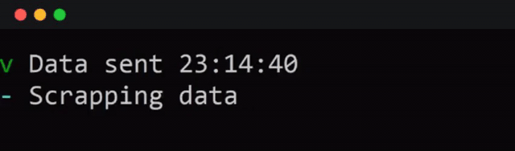
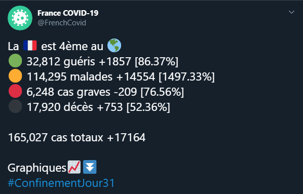
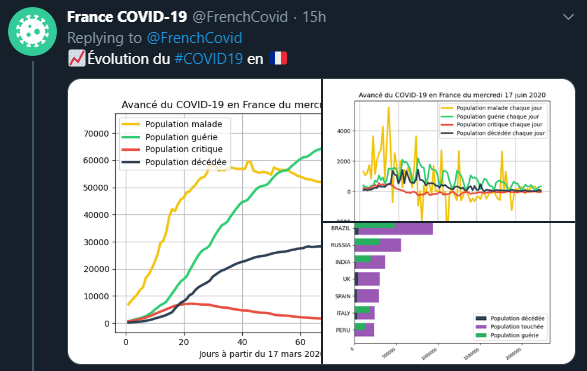
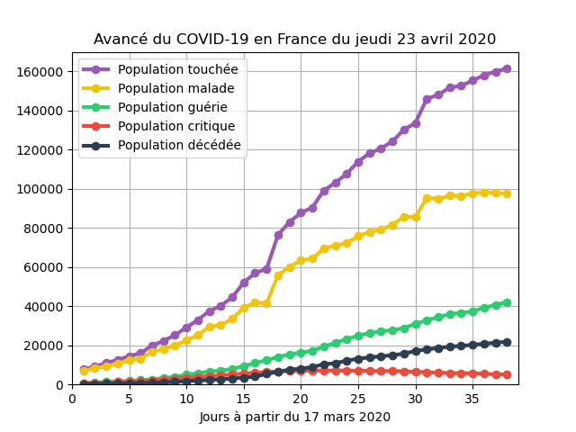
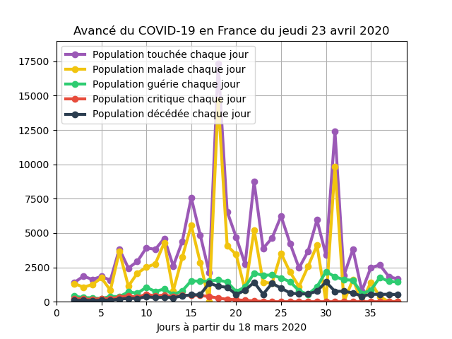
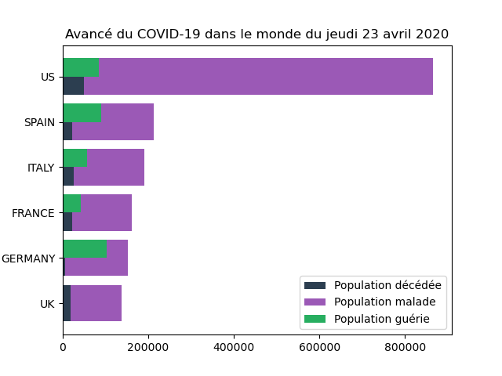
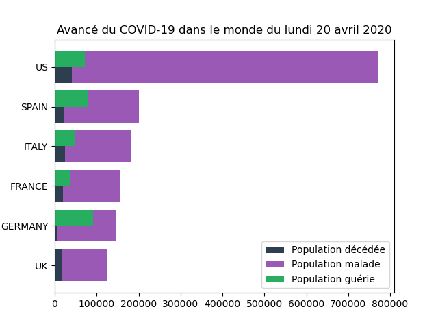

# Covid19bot 🦠

<h4 align="center">🤖 Bot permettant de donner chaque jour les statistiques du COVID-19 en France</h4>

<p align="center">
<a href="https://badge.fury.io/py/requests"></a>
  <a href="https://badge.fury.io/py/matplotlib"></a>
  <a href="https://badge.fury.io/py/halo"></a>
  <a href="https://badge.fury.io/py/tweepy"></a>
  <a href="https://badge.fury.io/py/imageio"></a>
</p>

<p align="center">
  <a href="#Fonctionnalités">Fonctionnalités</a> |
  <a href="#Utilisation">Utilisation</a> |
  <a href="#Enregistrement-en-CSV">Enregistrement en CSV</a> |
  <a href="#Tweet">Tweet</a> |
  <a href="#graphiques-générés-automatiquement">Graphique</a> |
  <a href="#Animation">Animation</a> |
  <a href="#Licence">Licence</a> |
  <br>
  <a href="#Contactez-moi">Contactez-moi</a> | 
  <a href="https://ronanren.github.io" target="_blank">Mon site personnel</a> 
</p>

<p align="center">
    
</p>

Bot utilisé sur le compte twitter : <a href="https://twitter.com/FrenchCovid" target="_blank">@FrenchCovid</a>

# Fonctionnalités

- Vérification régulière pour vérifier si les nouvelles données du jour sont publiées
- Enregistrement des nouvelles données quotidiennes dans un CSV
- Création de 3 graphiques (statistiques total, statistiques quotidiennes et statistiques mondiales des 5 premiers pays les plus touchés)
- Générer une animation des différents graphiques
- Création et envoi de 2 tweets (les données du jour et les différents graphiques)

# Utilisation

```bash
# Cloner ce dépôt
$ git clone https://github.com/ronanren/Covid19bot

# Accéder au dossier
$ cd Covid19bot

# Installer les dépendances
$ pip install -r requirements.txt

# Modifier le fichier config.py pour tweeter
consumer_key = "consumer_key"
consumer_secret = "consumer_secret"
access_token = "access_token"
access_token_secret = "access_token_secret"

# Lancer le script
$ python main.py

# Générer les animations
$ python createAnimation.py
```

# Enregistrement en CSV

**Les données sont enregistrées au sein du CSV <a href="https://github.com/ronanren/Covid19bot/blob/master/data/dataFrance.csv" target="_blank">_dataFrance.csv_</a>**

### Parsing des données sur <a href="https://www.worldometers.info/coronavirus/" target="_blank">Worldometers.info</a>

| Date | Total Cases | New Cases | Total Deaths | New Deaths | Total Recovered | Active Cases | Critical | New Recovered | New Active | New Critical | PlaceInWorld | Total Tests | New Tests |
| ---- | ----------- | --------- | ------------ | ---------- | --------------- | ------------ | -------- | ------------- | ---------- | ------------ | ------------ | ----------- | --------- |


- **Date du jour:** 'Date' sous la forme 'année-mois-jour'
- **Cas totaux:** 'Total Cases'
- **Nouveaux cas:** 'New Cases'
- **Morts totaux:** 'Total Deaths'
- **Nouveaux morts:** 'New Deaths'
- **Total des guéris:** 'Total Recovered'
- **Cas actuellement malades:** 'Active Cases'
- **Cas critique/en réanimation:** 'Critical'
- **Nouveaux guéris:** 'New Recovered'
- **Nouveaux malades:** 'New Active'
- **Nouveaux critique/en réanimation:** 'New Critical'
- **Place du pays dans le monde:** 'PlaceInWorld'
- **Total des tests réalisés:** 'Total Tests'
- **Nouveaux tests réalisés:** 'New Tests'

# Tweet

**Les pourcentages présentent l'évolution des données par rapport aux données de la veille.**

### Exemple des tweets quotidiens :

<p align="center">
  
  
</p>

# Graphiques générés automatiquement

<p align="center">
  
  
  
</p>

# Animation

**Le script _createAnimation.py_ permet de créer un gif pour montrer l'évolution des différents graphiques**

<p align="center">
  
  
  
</p>

# Licence

 <a href="https://github.com/ronanren/Covid19bot/blob/master/LICENSE" target="_blank">MIT</a> 

# Contactez-moi

**Twitter** : <a href="https://twitter.com/Ronanren" target="_blank">@Ronanren</a>
