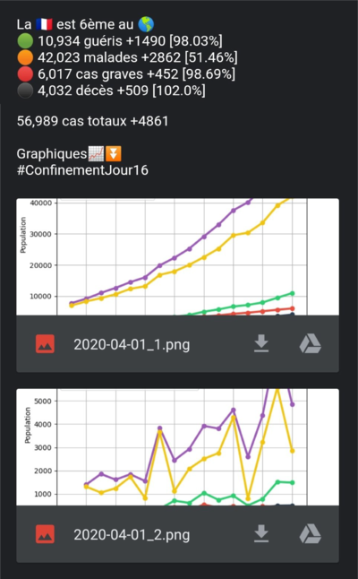

# Covid19bot 🦠

# Table des matières

- [Fonctionnalités](#Fonctionnalités)
- [Enregistrement en CSV](#Enregistrement-en-CSV)
- [Message par mail](#Message-par-mail)

Bot utilisé sur le compte twitter : [@FrenchCovid](https://twitter.com/FrenchCovid)

# Fonctionnalités

- Vérification régulière en intervalle de temps pour vérifier si les nouvelles données sont publiées
- Enregistrement des nouvelles données quotidiennes dans un CSV
- Création de 3 graphiques (statistiques total, statistiques quotidiennes et statistiques mondiales des 5 premiers pays les plus touchés)
- Création et envoi d'un message par mail des nouvelles statistiques pour tweeter


## Enregistrement en CSV

Voici les données enregistrées au sein du CSV, si une donnée est à 0, c'est à dire que la donnée n'est pas connu

| Date | Total Cases | New Cases | Total Deaths | New Deaths | Total Recovered | Active Cases | Critical | New Recovered | New Active | New Critical | PlaceInWorld | Total tests | New Tests |
| ---- | ----------- | --------- | ------------ | ---------- | --------------- | ------------ | -------- | ------------- | ---------- | ------------ | ------------ | ----------- | --------- |


Fichier csv mis à jour régulièrement : [dataFrance.csv](https://github.com/ronanren/Covid19bot/blob/master/data/dataFrance.csv)

## Message par mail

#### Gestion de connexion pour l'envoi de mail :

- Modifier le fichier `config.example.py` en `config.py` avec vos identifiants gmail (si c'est autre que gmail, changer le serveur SMTP)
- Format de `config.py` :

```python
login = "mail"
password = "password"
maildestination = "mail"
server = "server smtp"
port = 587
```

#### Les pourcentages :

Les pourcentages présentent l'évolution des chiffres par rapport aux chiffres de la veille.  
Par exemple, si il y a 1000 nouveaux guéris hier et 1000 nouveaux guéris aujourd'hui, alors cela donne 100%  
Une augmentation d'un chiffre par rapport à la veille donne un pourcentage > 100%

#### exemple de message reçu par mail :


